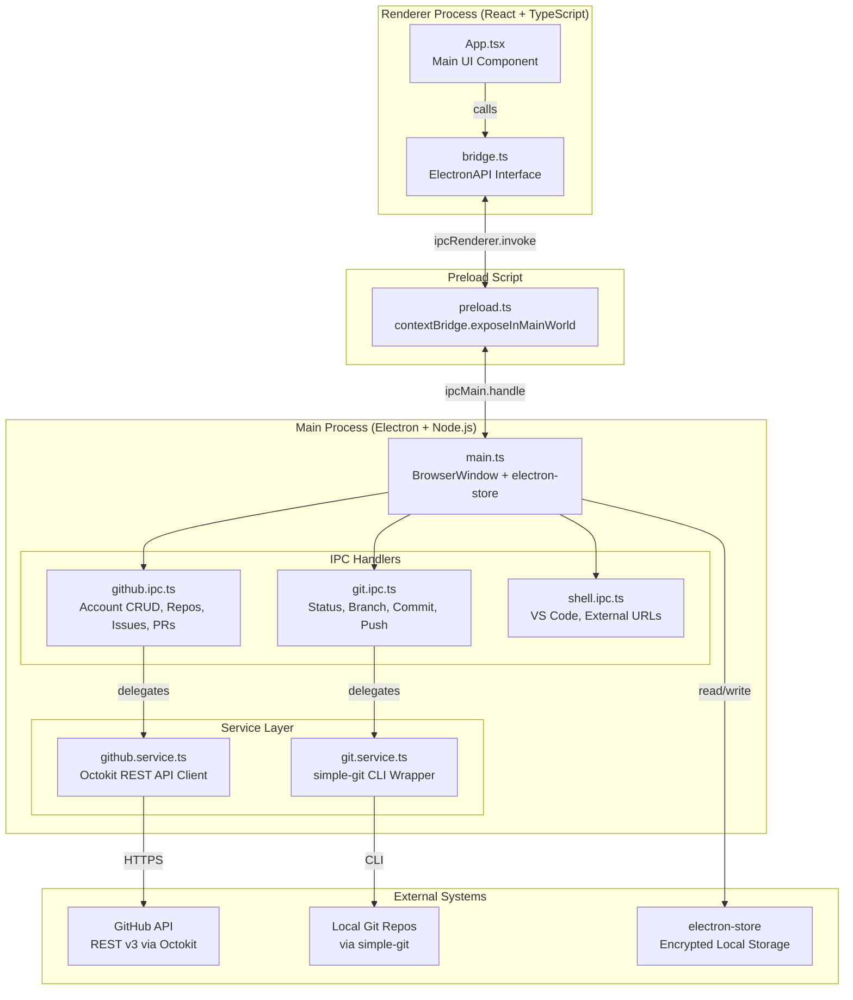
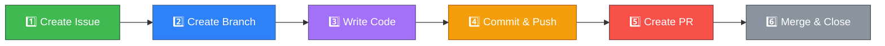

<p align="center">
  
</p>

<h1 align="center">GitFlow Dashboard</h1>

<p align="center">
  <strong>A visual pipeline manager for GitHub Issues, Pull Requests, and Git Branches</strong>
</p>

<p align="center">
  
  
  
  
  
  
</p>

---

## 🎯 What Is GitFlow Dashboard?

GitFlow Dashboard is a **cross-platform desktop application** that brings a visual, step-by-step GitFlow pipeline directly to your desktop. It connects to the GitHub API and your local Git repositories, providing a single unified interface for:

- **Viewing** all your GitHub repositories, issues, and pull requests.
- **Creating** issues, branches, commits, and pull requests — all from one screen.
- **Tracking** a visual pipeline: `Issue → Branch → Code → Commit → PR → Merge`.
- **Managing** multiple GitHub accounts with secure local token storage.
- **Linking** GitHub repos to local folders for real-time Git status monitoring.

---

## 🏗️ Architecture



---

## 🔄 GitFlow Pipeline

The application visualizes the complete GitFlow development lifecycle:



Each step in the pipeline is tracked visually on the detail page. The app automatically detects branch-issue links, commit status, and PR state.

---

## ✨ Key Features

| Feature                   | Description                                                                |
| ------------------------- | -------------------------------------------------------------------------- |
| **Multi-Account Support** | Add, switch, and delete multiple GitHub accounts with secure local storage |
| **Repository Browser**    | View all your repos with description, visibility, and quick-actions        |
| **Issue & PR Tracking**   | See open/closed/merged status with color-coded cards                       |
| **Visual Pipeline**       | Step-by-step progress tracker: Issue → Branch → Code → Commit → PR         |
| **Local Git Integration** | Link repos to local folders for real-time branch/status monitoring         |
| **Branch Management**     | Create, rename, delete, and switch branches from the app                   |
| **Commit & Push**         | Stage all changes, write a commit message, and push — one click            |
| **PR Creation**           | Open pull requests directly from the current branch                        |
| **VS Code Integration**   | Open any linked repo in VS Code with one click                             |
| **Profile & Stats**       | View your GitHub profile, repo count, total issues, and total PRs          |
| **Help Guide**            | Built-in interactive help page explaining the full workflow                |
| **Auto-Refresh**          | Issues and PRs refresh automatically every 15 seconds                      |
| **Dark Theme**            | Premium GitHub-inspired dark UI with smooth animations                     |

---

## 📦 Installation

### For Users (Pre-built Installer)

1. Go to the [Releases](https://github.com/MohamedAli1937/GitFlow-Dashboard/releases) page.
2. Download the installer for your platform:
   - **Windows**: `.exe` installer (e.g., `GitFlow Dashboard-Windows-<version>-Setup.exe`)
   - **macOS**: `.dmg` installer (e.g., `GitFlow Dashboard-Mac-<version>-Installer.dmg`)
   - **Linux**: `.AppImage` package (e.g., `GitFlow Dashboard-Linux-<version>.AppImage`)
3. Run the installer and follow the on-screen instructions.
4. Launch the app and add your GitHub Personal Access Token (PAT).

#### How to Generate a GitHub Token

1. Go to [GitHub → Settings → Developer Settings → Personal Access Tokens → Tokens (classic)](https://github.com/settings/tokens).
2. Click **"Generate new token (classic)"**.
3. Select scopes: `repo`, `read:user`, `user:email`.
4. Copy the generated token (starts with `ghp_...`).
5. Paste it into the app's login screen.

### For Developers (Build from Source)

```bash
# Clone the repository
git clone https://github.com/MohamedAli1937/GitFlow-Dashboard.git
cd GitFlow-Dashboard

# Install dependencies
npm install

# Run in development mode (hot-reload)
npm run dev

# Build production installer
npm run build
```

---

## 🛠️ Tech Stack

| Layer             | Technology             | Purpose                                           |
| ----------------- | ---------------------- | ------------------------------------------------- |
| **Frontend**      | React 18, TypeScript 5 | UI components and state management                |
| **Desktop Shell** | Electron 30            | Cross-platform desktop wrapper                    |
| **Build Tool**    | Vite 5                 | Fast HMR dev server and production bundler        |
| **GitHub API**    | `@octokit/rest`        | Authenticated REST API calls                      |
| **Local Git**     | `simple-git`           | Git CLI operations (status, branch, commit, push) |
| **Storage**       | `electron-store`       | Secure local storage for accounts and tokens      |
| **Packaging**     | `electron-builder`     | NSIS (Windows), DMG (macOS), AppImage (Linux)     |
| **Linting**       | ESLint + Prettier      | Code quality and formatting                       |

---

## 📁 Project Structure

```
GitFlow-Dashboard/
├── build/                    # App icons (icon.png)
├── electron/                 # Electron main process
│   ├── main.ts               # Window creation, store init, token bootstrap
│   ├── preload.ts            # Context bridge (IPC → renderer)
│   ├── ipc/
│   │   ├── github.ipc.ts     # Account CRUD, repos, issues, PRs
│   │   ├── git.ipc.ts        # Local git operations
│   │   └── shell.ipc.ts      # VS Code launch, external URLs
│   └── services/
│       ├── github.service.ts # Octokit client, API methods
│       └── git.service.ts    # simple-git wrapper functions
├── src/                      # React renderer process
│   ├── App.tsx               # Main application component (all views)
│   ├── api/bridge.ts         # TypeScript interface for electronAPI
│   ├── index.css             # Global styles and CSS variables
│   ├── ErrorBoundary.tsx     # React error boundary wrapper
│   └── main.tsx              # React entry point
├── electron-builder.json5    # Packaging configuration
├── package.json              # Dependencies and scripts
├── tsconfig.json             # TypeScript configuration
└── vite.config.ts            # Vite + Electron plugin configuration
```

---

## 🔐 Security

- **Tokens are stored locally** using `electron-store` on your machine. They are never sent to any third-party server.
- **Context Isolation** is enabled (`contextIsolation: true`), meaning the renderer process cannot directly access Node.js APIs.
- **Node Integration** is disabled (`nodeIntegration: false`), following Electron security best practices.
- All GitHub API calls are made from the **main process** through secure IPC channels.

---

## 🚀 How to Update & Publish a New Version

Follow these steps every time you want to release a new version:

### Step 1: Make Your Changes

Edit the source code as needed (fix bugs, add features, etc.).

### Step 2: Bump the Version

Update the `version` field in `package.json` to the target version (e.g., `1.0.0` or `1.0.1` following Semantic Versioning):

```json
{
  "version": "1.0.0"
}
```

Use [Semantic Versioning](https://semver.org/):

- **Patch** (`x.x.1`): Bug fixes, no new features.
- **Minor** (`x.1.x`): New features, backward compatible.
- **Major** (`1.x.x`): Breaking changes.

### Step 3: Build the Installer

```bash
npm run build
```

This runs `tsc → vite build → electron-builder` and generates the installer.

### Step 4: Commit & Tag

```bash
git add .
git commit -m "release: v1.0.0"
git tag v1.0.0
git push origin main --tags
```

### Step 5: Create a GitHub Release

1. Go to your repo → **Releases** → **Draft a new release**.
2. Select the tag you just pushed (e.g., `v1.0.0`).
3. Write release notes describing what changed.
4. Upload the installer files from the build output directory:
   - `.exe` for Windows
   - `.dmg` for macOS
   - `.AppImage` for Linux
5. Click **Publish release**.

### Step 6: Users Download the Update

Users visit the Releases page and download the latest installer. Future versions could integrate `electron-updater` for automatic updates.

---

## 🤝 Contributing

1. Fork the repository.
2. Create a feature branch: `git checkout -b feature/my-feature`.
3. Commit your changes: `git commit -m "feat: add my feature"`.
4. Push to your fork: `git push origin feature/my-feature`.
5. Open a Pull Request.

---

## 📄 License

This project is licensed under the MIT License.

---

<p align="center">
  Built with ❤️ by <a href="https://github.com/MohamedAli1937">Mohamed Ali</a>
</p>
